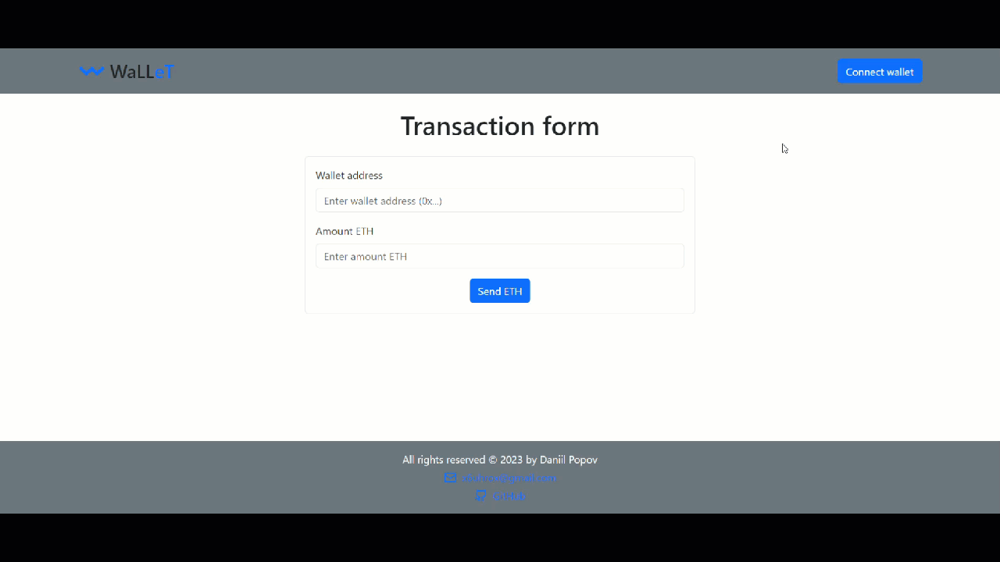

** Language: [Ukrainian](README.md), [English](README.en.md).**

## App view

### Desktop

### Mobile

## Description of the project

Web app for working with tokens in the Ethereum Goerli network on mobile and desktop devices.

## Implemented

1. One-page web app.
2. Connecting to your wallet in the Ethereum Goerli network.
3. Checking the balance of the account and the address of the wallet.
4. Transfer of a token with a connected wallet to another address in the Ethereum Goerli network.

## Technology stack:

## Implementation of the project:

- The project is built with [Vite] (https://vitejs.dev/).
- Components are created using the [React-bootstrap] library (https://react-bootstrap.netlify.app/)
- The project used the state management library [ReduxToolkit](https://redux-toolkit.js.org/).
- Required data is stored in `localStorage` [Redux Persist] (https://www.npmjs.com/package/redux-persist)

## Instructions for using:

To work with the wallet you need to install [MetaMask] (https://metamask.io/) - a web browser extension that allows users to manually manage their cryptocurrency holdings and interact with decentralized add-ons (DApps) on the Ethereum blockchain. It allows you to create and work with a wallet, sign transactions and create various actions on the blockchain.

1. Install the MetaMask extension in your web browser (eg Google Chrome, Mozilla Firefox) or download the official MetaMask extension from the extension store (App Store for iOS or Google Play Store for Android).
2. After installing the extension or application, you need to create a new wallet, or restore an existing one using seed phrases.
3. After completing these steps, connect your wallet to the web application by clicking the "Connect wallet" button
4. After successfully connecting the wallet, instead of "Connect wallet", information about the address, balance of the wallet, as well as the "Disconnect" button to disconnect the wallet will appear. Fill in the "Wallet address" and "Amount ETH" fields in the "Transaction form" and transfer the tokens by clicking the "Send ETH" button.
5. If necessary, you can copy the address and balance of the wallet by clicking on the appropriate fields.

## Link to web app:
[Link to web app](https://my-wallet-app-black.vercel.app/)

## Test task:
[Test task](https://docs.google.com/document/d/19J4foINdh6IiC766zgXiU9EAIxNMc75fqWbqEcP_4Ms/edit?usp=sharing)